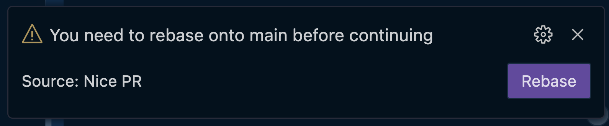

# nice-pr README

## **ALPHA VERSION**

Create nice pull requests by changing the git history using this visual tool. It can also suggest a new history.

## History behind

When you want to change the history of your branch, it is important that your branch is up to date. This ensures that your changes are actually applied on top of the current state of the codebase. When you edit the history of a commit, Nice-PR will warn you if the branch is currently not up to date.

To put your changes on top of the latest history you will need to **rebase**. By clicking the button you will be able to choose the base branch to apply your changes on top of. This ensures that any conflicts will be resolved in the existing commits of your branch, unlike merging which creates a new commit in your branch history.

## Changes before release

- Support identifying base branch
- Make sure it all works
